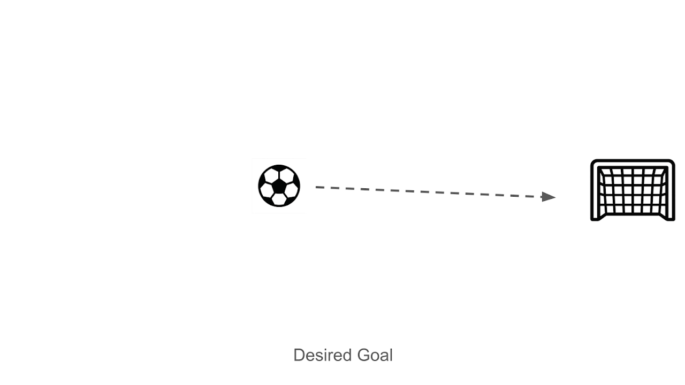
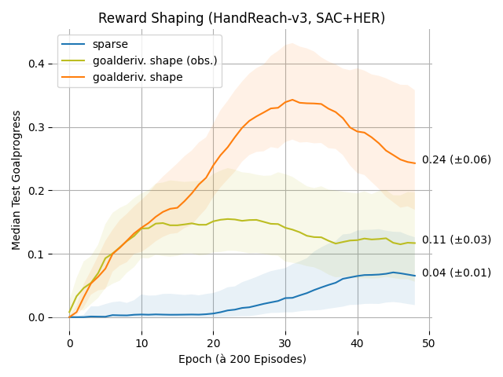
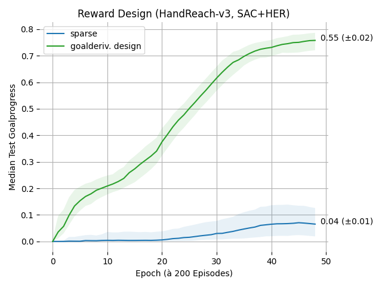
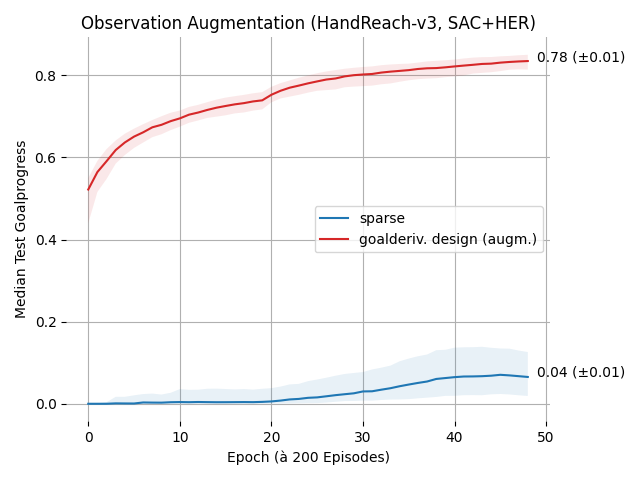
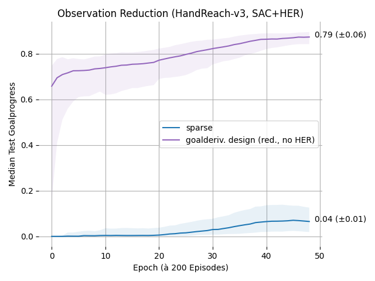
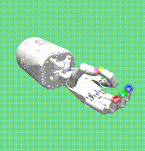
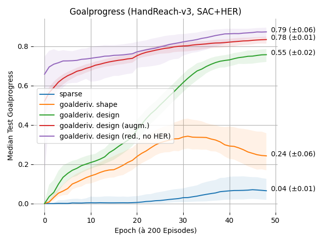
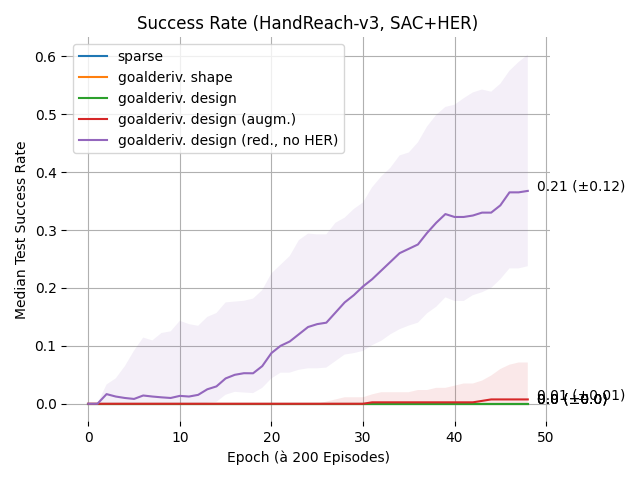

---
title: "Reward and Observe Higher-Order Goalderivatives (2025)"
bibliography: bibliography.bib
csl: bibstyle.csl
output: pdf_document
---

# (Research) Reward and Observe Higher-Order Goalderivatives (2025)

Nhu Huy Le \
Hamburg University of Technology

This repository researches into possible improvements to Goal-Oriented Reinforcement Learning (RL) by evaluating the **Differential Goalkinematic State (DGS)**, whose components are based on the distance to the goal - in the following called goal-directed derivatives or simply *goalderivatives*.

The probed improvements include sample-efficiency during training and generality of the resulting policy to unseen goals.

*Keywords: Deep Reinforcement Learning, Robotics*

---

A **goalderivative** $d^{(k)}$ of order $k>1$ is the rate of change in the scalar distance $d$ (specific to e.g. the $L²$-norm) or its derivatives (velocity $d^{(1)}$, acceleration $d^{(2)}$, jerk $d^{(3)}$ etc.) *towards* a numerically defined goal.

In time-discrete environments, the goalderivatives at a time $t_i$ can be recursively estimated with the distance to the goal (*goaldistance*) at $t_i$ by backward difference:

$$
d^{(0)}(t_i) = d(t_i) := \text{goaldistance at time } t_i
$$

$$
d^{(k)}(t_i) \approx \frac{d^{(k-1)}(t_i) - d^{(k-1)}(t_{i-1})}{t_i - t_{i-1}}
$$

In a vector, multiple goalderivatives of $k > 1$ at $t_i$ form a differential kinematic state vector

$$
s_{DGS}(t_i) = \begin{pmatrix} d^{(1)} \\ d^{(2)} \\ \vdots \\ d^{(k)} \end{pmatrix}(t_i)
$$

The idea is now to evaluate the vector for either reward design, observation augmentation, or both.

> **Summary** 
>
> Instead of using only the distance to the goal, its derivatives are also considered - in the reward function or as part of the observation in RL.

RL algorithms are applied to a formal **Markov Decision Process (MDP)** 

$$
\begin{split}
M &= (\text{states, actions, transition probabilities, discount factor, rewards}) \\
&= (S, A, T, \gamma, R)
\end{split}
$$

to find, for each **state** $s_k \in S$, the optimal **action** $a^*_{k} \in A$ that maximizes the expected $\gamma$ - discounted return 

$$
G = \mathbb{E} [\sum^{\infty}_{t=0} \gamma^t r_t]
$$

of experienced **rewards** $\{r', r'',\dots\} \subseteq R$ from its next states $\{s', s'',\dots\} \subseteq S$, which are reached with probabilities in $T$. However with RL, $T$ and $R$ are initially unknown and must be gradually discovered by exploration similar to *trial and error*. [@barto2021reinforcement]

The result is an optimal **policy** $\pi^* : S \to A$ that assigns to each state its optimal action. Note that a higher-level goal is not formalized in the MDP - its optimality does not ensure the objective success in reaching (or keeping) an indirect goal. Careful and effective design of the underlying MDP is therefore crucial for the correct and efficient convergence of RL.

> **Research Claim 1** (Goalderivative Potential-Based Reward Shaping)
> 
> In goal-oriented RL training towards an optimal policy, by adding to the existent rewards a potential-based shaping term based on the DGS vector, the training can be more efficient without changing the original optimal policy.

In this work, rewards are deterministic, i.e. they are assigned to states by the real **reward function** $R:S\times A \to \mathbb{R}$, meaning at state $s_t$ the algorithm receives a reward $r_t = R(s_t, a_t)$. It is proven that by adding a strictly **shaping function** $F(s_t, a_t) = \gamma\Phi(s_{t+1}) - \Phi(s_t)$ with state-dependent potentials $\Phi$, the reward function can be modified to

$$
R' = R + F
$$

 without changing the optimal policy: By solving the modified MDP $M' = (S, A, T, \gamma, R')$ we also solve the original MDP $M$.

With a naive goalkinematic potential

$$
\Phi_{naive}(s) =
-
\left\lVert 
\begin{pmatrix}
d \\ s_{DGS}
\end{pmatrix}
\right\rVert_2
=
-
\left\lVert 
\begin{pmatrix}
d \\ d^{(1)} \\ d^{(2)} \\ \vdots \\ d^{(k-1)}
\end{pmatrix}
\right\rVert_2,
$$
 
achieving states that are not only close, but are also expected to be closer in the next states, will be rewarded higher - their goalderivatives are more favorable.
On the other hand, achieving states that are only statically close, or even moving away, will be rewarded lower.
However, such a frequent rewarding enables *reward hacking*, where the agent might oscillate between moving closer and farther from the goal without actually reaching the goal, i.e. the converged policy is not the optimal policy, let alone a successful one. With a **conjunctive goalderivative potential (CGP)**

$$
\Phi_{conj}(s) =
\begin{cases}
1, & \text{if } \forall k: d^{(k)} \lt 0 ,\\
-1, & \text{if } \forall k: d^{(k)} \gt 0, \\
0, & \text{otherwise,}
\end{cases} \qquad (d^{(k)} \in s_{DGS}) \\
$$

that type of reward hacking is less probable with higher order $k$ , since isolated goalderivatives are not rewarded anymore. Since they are also not penalized, exploration is allowed - this is especially beneficial in multi-goal environments.

In 5 simulations à 50 epochs (one epoch consists of 200 episodes à 50 timesteps) within Gymnasium's sparse *HandReach* environment [@plappert2018multi], where a robotic hand is trained to reach different coordinates with its fingertips, the shaped reward ($k=3, \gamma = 0.95$)
$$
\begin{split}
\hat R_1(s,a) &= R(s,a) + F(s,a) \\ 
&= R(s,a) + 0.95 * \Phi_{conj}(s') - \Phi_{conj}(s)
\end{split}
$$

increased the training **sample efficiency**, defined as the area under the curve (AUC) of the test *goalprogress*

$$
\begin{split}
P = \frac{d_0 - d_{end}}{d_0}\qquad (0 \le P \le 1) \\ 
(d_{end} := \text{goaldistance at the end of the episode}),
\end{split}
$$

by factor **2.75** (Fig. 1: yellow line) compared to the unshaped baseline reward (Fig. 1: blue line) (median). The details of the experiments are described in the full work.

 \
**Fig. 1:** *Median test goalprogress by reward shaping (yellow and orange line) with interquartile range (IQR, shaded area) and mean AUC (±s.d., label)*

Note: With potential-based shaping, this claim theoretically requires that the goaldistance and the DGS are part of the observable state space, which is a separate focus in this research. However, in the experiments, the efficiency gains with non-observable goaldistance and DGS were even greater with factor **6** (Fig. 1: orange line) compared to the baseline, i.e. possibly justifying the violation of the Markov assumption.

> **Research Claim 2** (Goalderivative Reward Design)
> 
> In goal-oriented RL training towards an optimal policy, by designing rewards based on the DGS vector, the training can be more efficient.

 \
**Fig. 2:** *Median test goalprogress by reward design (green line) with IQR (shaded area) and mean AUC (±s.d., label)*

> **Research Claim 3** (Goalkinematic Observation Augmentation)
> 
> In goal-oriented RL training towards an optimal policy, by adding goalkinematic information to the observation space, the training can be more efficient.

 \
**Fig. 3:** *Median test goalprogress by obs. augmentation (red line) with interquartile range (shaded area) and mean AUC (±s.d., label)*

> **Research Claim 4** (Goalkinematic Observation Reduction)
> 
> In goal-oriented RL training towards an optimal policy, by reducing the observation space to contain *only* goalkinematic information, the training can be successful, more efficient and more general.

 \
**Fig. 4:** *Median test goalprogress by obs. reduction (magenta line) with IQR (shaded area) and mean AUC (±s.d., label)*

 |  | 
|:--:| :--:| 
| *Real-time screen recording of 9e3 rendered training steps directly after learning of the networks started for the first time (**blank policy**)* | *Real-time screen recording of rendered evaluation steps after 5e5 training steps (**trained policy**)*

> **Summary** 
>
> ...

 \
**Fig. 5:** *Median test goalprogress overview (line) with IQR (shaded area) and mean AUC (±s.d., label)*

 \
**Fig. 6:** *Median test success rate overview (line) with IQR (shaded area) and mean AUC (±s.d., label)*

## Case Study: Fluent Visual Imitation of Hand Gestures by a Robotic Hand (Multi-Goal RL with Multi-Dimensional Goals)

(reward function granularity)

(hand gesture imitation)

## Hyperparams
| Hyperparams | Relevance | Examples | Comment |
| --- | --- | --- | --- |
| $\gamma$ (discount) | +++ | 0.5 (shortsight: non-term., direct, fast/dumb), 0.95 (longsight: term., indirect, prudent/careful) | watch actor NN learning loss
| shaping vs. redesign | ++     |  |
| goalkin. reward aggregate    | +++    | all(DGS) (term.), any(DGS) (non-term.) |
| goalderiv. order k    | ++    | oscillation-res. (>2) | 
| goalkin. obs.    | +++    | deltas, dist/derivs., augm. vs reduce | 
| goalobs.    | ++   | single-goal vs. multi-goal | 
| non-lin. activ.    | +   | ReLU (pos.) vs. Tanh (neg., normalized goal) | 
| reward freq.    | +++   | sparse (indirect) vs. dense (direct, straight) | 

## Anecdotes
> "with enough goaldimensions, the goaldistance becomes meaningful goalprogress"

> "efficiency does not necessarily mean success/effectiveness"

## TODO
* hyperparams
* overviewing tables
* different algo(s)
* different env(s)
* "proving" imgs
* "proving" graphs (eg. training process metric?)
* "proving" gifs (eg. sped up training process video?)
* "proving" code snippets
* disclaimer (autonomity)
* license

* dense HER baseline, too?
* goalprogress vs. success
* (compare/combine with HER, vs. (normalized) multi-dim. goals w/o threshold, ie. inexact goals with different reachable (unknown) thresholds, adaptability/generality to unseen goals (interpolative vs. extrapolative))
* C3: adding to the markov property
* C4: define success (vs. goalprogress), define general
* C2,C3 w/o HER
* C4 w/ HER
* sparse baseline unobs.
* formal proofs?

## References
* HER
* HER envs.
* RL bible (barto, sutton)
* MDP
* markov property
* goaldistance
* potential-based shaping
* reward engineering
* observation augmentation
* observation reduction (for generality)
* multi-goal

* https://openai.com/index/ingredients-for-robotics-research/
* https://wandb.ai/rodrigodelazcano/gym_robotics/runs/1s3fuwye?nw=nwuserrodrigodelazcano
